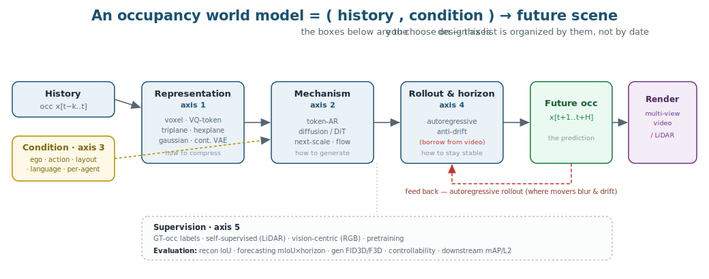
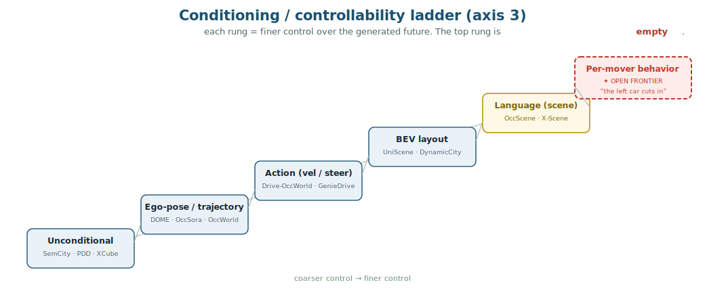

# Awesome Occupancy World Models 

A curated, **axis-indexed** guide to **occupancy (occ) world models** for autonomous driving.

Most lists are chronological dumps that tell you *what exists*. This one is built to tell you *how to think about the field* — so you can place any paper, see the open cells, and design a new method. The spine is one idea:

> **An occupancy world model is a function `(history, condition) → future scene`.** Every paper is a set of choices on a handful of orthogonal **design axes** — representation, mechanism, conditioning, rollout, supervision — judged by a handful of **metrics**. Organize by the axes and the structure of the field falls out.

> **Scope.** Core = generative / forecasting world models in the 3D **occupancy** space. We also track the **video** and **LiDAR** world-model lines — not as a catalogue, but as **machinery occ borrows** (anti-drift rollout, multi-view rendering, language control). Each neighbor entry says *what to port*.

---

## Contents

**Part I · Framing** — [What & why](#what-is-an-occupancy-world-model--and-why) · [The cheat sheet](#the-cheat-sheet)

**Part II · The design axes** — [1 Representation](#axis-1--representation) · [2 Mechanism](#axis-2--generative-mechanism) · [3 Conditioning & control](#axis-3--conditioning--control) · [4 Rollout & horizon](#axis-4--rollout-horizon--stability) · [5 Supervision & data](#axis-5--supervision--data-efficiency)

**Part III · How the field is judged** — [Datasets](#datasets) · [Evaluation](#evaluation--what-each-metric-answers-and-its-blind-spot) · [Leaderboard](#leaderboard-read-honestly)

**Part IV · What it's for & where it's going** — [Data engine & simulator](#occupancy-as-a-data-engine--simulator) · [Open frontiers](#open-frontiers)
**Borrowing from neighbors** — [Video WMs](#video-driving-world-models--what-occ-borrows) · [Language→scenario mechanisms](#language-controlled-scenario-generation--four-mechanisms-to-port) · [LiDAR WMs](#lidar--point-cloud-world-models)
[Surveys & lists](#surveys--other-lists)

---
---

# Part I · Framing

## What is an occupancy world model — and why

A 3D **occupancy** grid is the cheapest representation that is *both* geometric (where stuff is) and semantic (what it is), sensor-agnostic, and dense. An **occupancy world model** learns to *roll it forward in time under control* — predict / generate the future occupancy given history and a condition (ego motion, an action, a layout, text).

Why care, beyond a benchmark number: occupancy is the **editable physics layer** of an AD stack. A good occ world model is (i) a **forecaster** for end-to-end planning, (ii) a **simulator** you can drive and edit, and (iii) a **data engine** that manufactures sensor-grounded scenes — including the long-tail ones logs never contain. Whether any model actually delivers (ii)/(iii) is [largely unproven](#occupancy-as-a-data-engine--simulator) — which is where the open work is.

## The cheat sheet

One row per model, decomposed across the axes. Read a row to understand a method; read a column to see the menu of choices; scan for the empty cells to find your niche.

| Model | Representation | Mechanism | Control (axis 3) | Supervision | Venue |
|---|---|---|---|---|---|
| [**OccWorld**](https://arxiv.org/abs/2311.16038) | VQ tokens | token-AR (GPT) | ego (joint) | GT occ | ECCV'24 |
| [**OccSora**](https://arxiv.org/abs/2405.20337) | 4D tokenizer | diffusion (DiT) | trajectory | GT occ | arXiv'24 |
| [**DOME**](https://arxiv.org/abs/2410.10429) | continuous VAE | diffusion (DiT) | ego-trajectory | GT occ | arXiv'24 |
| [**COME**](https://arxiv.org/abs/2506.13260) | continuous VAE | diffusion + control | scene-centric forecast | GT occ | NeurIPS'25 |
| [**DynamicCity**](https://arxiv.org/abs/2410.18084) | HexPlane | diffusion (DiT) | traj / command / layout | GT occ | ICLR'25 |
| [**UniScene**](https://arxiv.org/abs/2412.05435) | occ-VAE | diffusion | **BEV layout** | GT occ | CVPR'25 |
| [**GenieDrive**](https://arxiv.org/abs/2512.12751) | tri-plane VAE | AR + E2E | action (MCA) | GT occ | CVPR'26 |
| [**I²-World**](https://arxiv.org/abs/2507.09144) | intra/inter VQ | token-AR (enc-dec) | scene-transform | GT occ | ICCV'25 |
| [**OccTENS**](https://arxiv.org/abs/2509.03887) | next-scale tokens | next-scale AR | pose | GT occ | RA-L'26 |
| [**OccLLaMA**](https://arxiv.org/abs/2409.03272) | VQ tokens | AR (LLM) | **language** (QA) + action | GT occ | arXiv'24 |
| [**X-Scene**](https://arxiv.org/abs/2506.13558) | tri-plane VAE | diffusion | **text → layout** | GT occ | NeurIPS'25 |
| [**OccScene**](https://arxiv.org/abs/2412.11183) | voxel + RGB | joint diffusion | **text** | GT occ | arXiv'24 |
| [**SemCity**](https://arxiv.org/abs/2403.07773) | tri-plane | diffusion | unconditional / edit | GT occ | CVPR'24 |
| [**XCube**](https://arxiv.org/abs/2312.03806) | sparse-voxel hierarchy | cascaded diffusion | uncond / weak text | shape/scene | CVPR'24 |
| [**Drive-OccWorld**](https://arxiv.org/abs/2408.14197) | BEV | token-AR | action (vel/steer/cmd) | vision-centric | AAAI'25 |
| [**GaussianWorld**](https://arxiv.org/abs/2412.10373) | 3D Gaussians | streaming update | sensor | vision-centric | CVPR'25 |
| [**UnO**](https://arxiv.org/abs/2406.08691) | continuous field | — (occ field) | — | self-sup (LiDAR) | CVPR'24 |

*Patterns to notice:* representation is trending **plane-factored** (triplane/hexplane) for efficiency; mechanism splits **AR (planning-friendly, fast)** vs **diffusion (fidelity, controllable)**; the **control** column climbs a ladder that runs out exactly at *language → per-agent behavior*; almost everything is supervised on **GT occ** — self-/vision-supervision is the minority.

---
---

# Part II · The design axes

## Axis 1 — Representation

*How the dense `200×200×16` grid is compressed into something a generator can model. This choice dominates efficiency and fidelity.*

- **Dense voxel / 3D-conv** — no compression; expensive. **OccGen** — Generative Multi-modal 3D Occupancy Prediction. *ECCV'24*. [[paper]](https://arxiv.org/abs/2404.15014) — diffusion "noise→occ" refinement from sensors.
- **Discrete VQ tokens** — occupancy as a "language"; enables GPT-style AR. **OccWorld** [[paper]](https://arxiv.org/abs/2311.16038) · **OccLLaMA** [[paper]](https://arxiv.org/abs/2409.03272) · **I²-World** (intra-scene + inter-scene tokenizers) [[paper]](https://arxiv.org/abs/2507.09144).
- **Continuous VAE latent** — smoother, diffusion-friendly. **DOME** [[paper]](https://arxiv.org/abs/2410.10429) — the continuous-latent diffusion baseline most follow-ups build on.
- **Plane-factored (triplane / hexplane)** — the current efficiency winner. **SemCity** (triplane) [[paper]](https://arxiv.org/abs/2403.07773) · **GenieDrive** (tri-plane VAE, latent ~58% of prior) [[paper]](https://arxiv.org/abs/2512.12751) · **T³Former** (delta-triplane) [[paper]](https://arxiv.org/abs/2503.07338) · **DynamicCity** (HexPlane, 4D) [[paper]](https://arxiv.org/abs/2410.18084).
- **Sparse-voxel hierarchy** — high-res large scenes. **XCube** (up to 1024³, VDB) [[paper]](https://arxiv.org/abs/2312.03806).
- **3D Gaussians** — explicit, continuous motion. **GaussianWorld** [[paper]](https://arxiv.org/abs/2412.10373) — streaming occ via Gaussian updates.

## Axis 2 — Generative mechanism

*How the future is produced. The field's central fork: autoregression vs diffusion.*

- **Token-AR / GPT-style** — next-token / next-scene; fast, plays well with planning, but autoregressive drift. **OccWorld** [[paper]](https://arxiv.org/abs/2311.16038) · **OccLLaMA** [[paper]](https://arxiv.org/abs/2409.03272) · **RenderWorld** [[paper]](https://arxiv.org/abs/2409.11356) · **I²-World** (real-time, 94.8 FPS) [[paper]](https://arxiv.org/abs/2507.09144).
- **Latent diffusion / DiT** — high fidelity, naturally controllable, full-sequence; slow. **DOME** [[paper]](https://arxiv.org/abs/2410.10429) · **OccSora** [[paper]](https://arxiv.org/abs/2405.20337) · **UniScene** [[paper]](https://arxiv.org/abs/2412.05435) · **DynamicCity** [[paper]](https://arxiv.org/abs/2410.18084) · **SemCity** [[paper]](https://arxiv.org/abs/2403.07773) · **COME** [[paper]](https://arxiv.org/abs/2506.13260).
- **Next-scale (VAR-style)** — coarse-to-fine; efficiency + long horizon. **OccTENS** (temporal next-scale) [[paper]](https://arxiv.org/abs/2509.03887) · **XCube** (cascaded) [[paper]](https://arxiv.org/abs/2312.03806) · **PDD** (pyramid discrete diffusion) [[paper]](https://arxiv.org/abs/2311.12085).
- **Flow matching** — emerging, fast sampling. **Foundational LiDAR WM** (Swin-VAE + latent flow matching) [[paper]](https://arxiv.org/abs/2506.23434).
- **VAE + AR + end-to-end** — the current Occ-board leader. **GenieDrive** (tri-plane VAE + Mutual Control Attention, jointly E2E) [[paper]](https://arxiv.org/abs/2512.12751).

## Axis 3 — Conditioning & control

*What steers the future — the axis that decides whether you have a "world model" or just a predictor. It is a ladder of increasing control, and the top rung is empty.*

**Rung 0 — Unconditional / edit-only.** **SemCity** [[paper]](https://arxiv.org/abs/2403.07773) · **PDD** [[paper]](https://arxiv.org/abs/2311.12085) · **XCube** [[paper]](https://arxiv.org/abs/2312.03806).
**Rung 1 — Ego pose / trajectory.** **DOME** (trajectory-resampling) [[paper]](https://arxiv.org/abs/2410.10429) · **OccSora** (trajectory prompt) [[paper]](https://arxiv.org/abs/2405.20337) · **OccWorld** (joint ego) [[paper]](https://arxiv.org/abs/2311.16038).
**Rung 2 — Action (velocity / steer / command).** **Drive-OccWorld** (semantic/motion-conditional norm) [[paper]](https://arxiv.org/abs/2408.14197) · **GenieDrive** (Mutual Control Attention) [[paper]](https://arxiv.org/abs/2512.12751) · **DynamicCity** (command) [[paper]](https://arxiv.org/abs/2410.18084).
**Rung 3 — BEV layout / scene graph.** **UniScene** (layout→occ→video/LiDAR) [[paper]](https://arxiv.org/abs/2412.05435) · **Scaling-Up Occ-centric Generation** (+ NuPlan-Occ) [[paper]](https://arxiv.org/abs/2510.22973).

**Rung 4 — Language.** Three distinct sub-problems — keep them apart:
- *Query (open-vocab perception)* — language is a **test-time probe** over occ features; single-frame, no control. **OVO** [[paper]](https://arxiv.org/abs/2305.16133) · **POP-3D** [[paper]](https://arxiv.org/abs/2401.09413) · **VEON** [[paper]](https://arxiv.org/abs/2407.12294) · **LOC** [[paper]](https://arxiv.org/abs/2510.22141) · **OccNeRF** [[paper]](https://arxiv.org/abs/2312.09243).
- *VLA world models* — language is **one token type** alongside occ + action; weakly steering. **OccLLaMA** [[paper]](https://arxiv.org/abs/2409.03272) · **Occ-LLM** [[paper]](https://arxiv.org/abs/2502.06419) · **SparseOccVLA** [[paper]](https://arxiv.org/abs/2601.06474). ⚠️ *None of these is a text→occ generator — language conditions QA/planning; occ is forecast from past occ + action.*
- *Text-conditioned generation & editing* — text is a **generation condition**. The only two genuine text→occ works:
  - **OccScene** [[paper]](https://arxiv.org/abs/2412.11183) — pure text → occ + RGB (joint diffusion, perception↔generation mutual learning); controls *appearance*. Eval on SemanticKITTI / NuScenes-Occ / NYUv2.
  - **X-Scene** [[paper]](https://arxiv.org/abs/2506.13558) · [[project]](https://x-scene.github.io/) — text → (RAG + GPT-4o → BEV layout) → triplane occ → image/video/3DGS. Occ3D-nuScenes occ-gen FID3D 258.8 (vs UniScene 529.6); Real+Gen downstream 3DOD mAP 39.9. ⚠️ **closest competitor** — but long-tail only *claimed*, downstream only *aggregate*, editing only qualitative, no per-agent / collision control, closed-vocabulary.
  - Also: **HorizonWeaver** (multi-level semantic editing) [[paper]](https://arxiv.org/abs/2604.04887) · **VLA-World** (traj/direction-conditioned) [[paper]](https://arxiv.org/abs/2604.09059).

**Rung 5 — Per-mover behavior · OPEN FRONTIER.** Natural language that steers the future *behavior of individual agents* — *"the left car cuts in", "the pedestrian crosses"* — with the occ world model rolling out a physically consistent future. **No occ method does this.** Query never touches dynamics; VLA treats language as a co-token; text-gen conditions scene *appearance*, not per-mover *behavior over time*. This is the language interface to the per-mover-control problem — see [Open frontiers](#open-frontiers).

> **Borrowing the wiring.** Occ has adopted almost none of the language-control machinery developed for trajectories/video. The transferable mechanisms are catalogued in [Language→scenario mechanisms](#language-controlled-scenario-generation--four-mechanisms-to-port).

## Axis 4 — Rollout, horizon & stability

*A world model is used autoregressively, so single-step quality is not enough — error compounds and movers blur/drift. This is the battle occ borrows the most from video.*

- **COME** — Scene-Centric Forecasting Control. *NeurIPS'25*. [[paper]](https://arxiv.org/abs/2506.13260) — factors ego-motion out via scene-centric coordinates; injects a forecast as control into a frozen DOME to cut drift.
- **OccTENS** — temporal next-scale prediction for pose-controllable **long-term** generation. [[paper]](https://arxiv.org/abs/2509.03887)
- **DFIT-OccWorld** — decoupled dynamic flow: warp static, predict dynamic; non-autoregressive. [[paper]](https://arxiv.org/abs/2412.13772)
- **IR-WM** — predict the **residual** world change rather than the full next state. [[paper]](https://arxiv.org/abs/2510.16729)
- **GenieDrive** — rolls out to 20 s; still degrades gracefully but movers fade fastest. [[paper]](https://arxiv.org/abs/2512.12751)
- *The anti-drift toolbox itself lives in [video world models](#video-driving-world-models--what-occ-borrows).*

## Axis 5 — Supervision & data efficiency

*What you train on. The expensive default is dense GT occ; the interesting lines learn from raw sensors.*

- **GT occ labels** — the default for every generator above.
- **Self-supervised from LiDAR / point clouds** — no dense occ labels. **UnO** (continuous 4D occ field) [[paper]](https://arxiv.org/abs/2406.08691) · **ViDAR** (visual point-cloud forecasting pretraining) [[paper]](https://arxiv.org/abs/2312.17655) · **4D-Occ-Forecasting** [[paper]](https://arxiv.org/abs/2310.11239) · **UniWorld** [[paper]](https://arxiv.org/abs/2308.07234).
- **Vision-centric (RGB in)** — deployable, no occ at inference. **Drive-OccWorld** [[paper]](https://arxiv.org/abs/2408.14197) · **PreWorld** (2D-render supervision) [[paper]](https://arxiv.org/abs/2502.07309) · **OccProphet** (camera-only, efficient) [[paper]](https://arxiv.org/abs/2502.15180) · **RenderWorld** (Gaussian self-supervised label) [[paper]](https://arxiv.org/abs/2409.11356).
- **Pretraining / pretext** — occ forecasting as representation learning. **DriveWorld** [[paper]](https://arxiv.org/abs/2405.04390) · **UniWorld** [[paper]](https://arxiv.org/abs/2308.07234) · **Occupancy World Model for Robots** [[paper]](https://arxiv.org/abs/2505.05512).

---
---

# Part III · How the field is judged

## Datasets

*What data exists, and what each is actually used for. Occ3D-nuScenes is the de-facto driving bench; the rest fill gaps (outdoor SSC, synthetic dynamics, scale, indoor).*

| Dataset | Grid / range | Classes | Used for |
|---|---|---|---|
| [**Occ3D-nuScenes**](https://arxiv.org/abs/2304.14365) | 200×200×16 · 0.4 m · ±40 m | 17 (+free) | the main **forecasting & generation** bench |
| [**nuScenes-Occupancy / OpenOccupancy**](https://arxiv.org/abs/2303.03991) | denser voxels | 16 | occ prediction, generation recon |
| [**SemanticKITTI**](https://arxiv.org/abs/1904.01416) | 256×256×32 · 0.2 m | 19 | outdoor **scene-completion** & static generation |
| [**Occ3D-Waymo**](https://arxiv.org/abs/2304.14365) | 200×200×16 | 14 | large-scale forecasting / 4D generation |
| [**CarlaSC**](https://arxiv.org/abs/2203.07060) | 128×128×8 | 10 | **synthetic, fully-dynamic** generation (clean motion) |
| [**NuPlan-Occ**](https://arxiv.org/abs/2510.22973) (Scaling-Up) | nuScenes-style | — | **scale** (~19× more scenes) for occ-centric generation |
| [**Lyft-Occ**](https://arxiv.org/abs/2006.14480) | — | — | cross-dataset forecasting |
| [**NYUv2**](https://cs.nyu.edu/~silberman/datasets/nyu_depth_v2.html) | 240×144×240 | indoor | OccScene's indoor text→occ |

**Paired language / scenario data** (for the language-control line) — the scarce resource:
- [**ProSim-Instruct-520k**](https://arxiv.org/abs/2409.05863) — 10M+ text prompts over 520k real scenarios (the largest text↔scenario pairing). · [**DIVA**](https://arxiv.org/abs/2406.09386) (SimGen, 147.5 h) · [**nuScenes-QA**](https://arxiv.org/abs/2305.14836) (occ/scene VQA) · [**OpenDV-2K**](https://arxiv.org/abs/2403.09630) (1700 h driving video) · [crash-report sets](https://arxiv.org/abs/2505.18341) (CrashAgent).
> ⚠️ **There is no large paired text↔occupancy dataset.** This single fact pushes language→occ methods toward *text → LLM → layout → occ* (no paired data needed) rather than direct text-conditioning — see the [mechanisms](#language-controlled-scenario-generation--four-mechanisms-to-port).

## Evaluation — what each metric answers, and its blind spot

*Pick the metric for the question you're actually asking. Most disputes come from reporting one and claiming another.*

| Metric | Answers | Blind spot | Use when |
|---|---|---|---|
| **Recon IoU / mIoU** | is the **tokenizer/VAE** faithful? | says nothing about generation | reporting compression quality (don't conflate with gen) |
| **Forecasting mIoU/IoU × horizon** | how good is **prediction** over time? | **static-dominated** (movers swamped); **ego-confound** | forecasting; always give a dynamic×horizon breakdown |
| **FID / FID3D / FVD / KID** | is the output **distributionally realistic**? | a good *replayer* scores high; ≠ usefulness or control | comparing generative fidelity |
| **F3D / Precision–Recall / MMD / JSD / 1-NNA** | fidelity **vs diversity** of generated scenes | insensitive to per-instance correctness | generation diversity studies |
| **Controllability (detector-on-generated mAP, layout/text adherence)** | does the output **obey the condition**? | measured on **replayed** val, not counterfactual content | controllable-generation claims |
| **Downstream (det mAP/NDS, seg mIoU, planning L2/collision)** | is the generated data **actually useful**? | usually **aggregate**, not a rare slice; train-budget confound | data-engine claims — the one that matters |

**Three honesty rules** (they invalidate a lot of head-to-head claims):
1. **Ego confound** — diffusion leaders often consume **GT ego-trajectory**; AR methods *predict* it. Not apples-to-apples; state the regime per row.
2. **Regime mismatch** — vision-centric (RGB-in, e.g. GaussianWorld/GEM) vs GT-occ-token models are **not the same race**; never put them in one column.
3. **Aggregate mIoU is static-dominated** — background voxels dominate the count; mover accuracy at horizon is the unsolved thing. Prefer dynamic×horizon.

## Leaderboard (read honestly)

4D occ forecasting on **Occ3D-nuScenes** (GT-occ input, 2 s history → 3 s future), one protocol as reported in the GenieDrive paper:

| Method | Mech. | 1s | 2s | 3s | **Avg mIoU** | FPS | Params |
|---|---|---|---|---|---|---|---|
| [DOME '24](https://arxiv.org/abs/2410.10429) | clip-diffusion | 35.1 | 25.9 | 20.3 | 27.1 | 6.5 | 397M |
| [COME '25](https://arxiv.org/abs/2506.13260) | clip-diff + control | 42.8 | 33.0 | 27.0 | 34.2 | 0.3 | 692M |
| [I²-World '25](https://arxiv.org/abs/2507.09144) | token-AR (enc-dec) | 47.6 | 38.6 | 33.0 | 39.7 | 37 | 22.7M |
| [**GenieDrive '26**](https://arxiv.org/abs/2512.12751) | VAE + AR + E2E | 50.5 | 41.5 | 35.8 | **42.6** | 41 | 3.5M |

⚠️ This aggregate is **static-dominated** — a model can top it while failing the movers that matter. See the [evaluation blind spots](#evaluation--what-each-metric-answers-and-its-blind-spot).

---
---

# Part IV · What it's for, and where it's going

## Occupancy as a data engine & simulator

*The honest scoreboard for "world model as a long-tail data source." Separate **closes the loop** (trains a downstream model on generated data, reports real gains) from **realism-only** (FID/FVD, or a pretrained detector on replayed frames). Almost all positive results are **in-distribution camera-video augmentation** (+1–4 mAP/NDS); long-tail is usually **claimed, rarely measured on a held-out rare slice**.*

**Closes the loop (real downstream numbers):**
- **Delphi** [[paper]](https://arxiv.org/abs/2406.01349) — VLM **failure-mining**: GPT-4 attributes UniAD failures → generate similar data; **972 samples (4%) → collision 0.34→0.27 (~25% rel.)**. Closest to a true long-tail engine.
- **SubjectDrive** [[paper]](https://arxiv.org/abs/2403.19438) — StreamPETR **+3.6 mAP / +3.3 NDS**; *diversity, not volume, scales*.
- **MagicDrive** [[paper]](https://arxiv.org/abs/2310.02601) — BEVFusion **+2.52 mAP / +1.95 NDS**.
- **Panacea / Panacea+** [[paper]](https://arxiv.org/abs/2311.16813) — StreamPETR **+2.6 mAP / +2.3 NDS** (+AMOTA / lane).
- **DrivingDiffusion** [[paper]](https://arxiv.org/abs/2310.07771) — det **NDS 0.412 → 0.434**.
- **UniScene** [[paper]](https://arxiv.org/abs/2412.05435) — **only occ generator that closes the loop**: occ **+8.5 mIoU**, det **+3.13 mAP**. But occ is GT/layout-derived; long-tail only qualitative.

**Skeptic's anchor — cite it, beat it:** **Dream4Drive** [[paper]](https://arxiv.org/abs/2510.19195) — the augmentation benefit can become **negligible once you simply train longer on real data**. Aggregate +mAP may be a training-budget artifact.

## Open frontiers

The empty cells, stated as falsifiable targets:

1. **Language → per-mover control** (rung 5). Natural-language steering of individual agents' future behavior, rolled out as physically consistent occ. Distinct from ego/trajectory control (SparseOccVLA, VLA-World) which steers *you*, not *them*.
2. **Validated long-tail usefulness.** Even controllable occ generators (UniScene, X-Scene) validate only on **aggregate** downstream metrics — none proves a gain on a **held-out rare slice**. A *prior-driven, language-controlled occupancy generator that targets safety-critical scenes and proves a rare-slice downstream gain* does not exist in the verified literature. To claim it: (a) report **rare-class / held-out-scenario** metrics, not aggregate; (b) include the **train-longer-on-real** control (the Dream4Drive test); (c) avoid mixing real+synthetic modalities (which hides the synthetic contribution).
3. **Reactive / counterfactual agents.** Do these models encode *causal* responses to interventions (`do(ego brakes)` → the follower reacts), or only replay observational correlation? Untested for occ world models — a diagnosis-first opening.

---
---

# Borrowing from neighbors (machinery to port)

## Video driving world models — what occ borrows

*Occ's weakest axes (long-horizon stability, multi-view rendering, rich conditioning) are video's strongest. Each entry notes **what to port**.*

**A. Anti-drift / long-horizon rollout** *(port: rollout schedules, memory, reference-frame anchoring).*
- **GAIA-1** [[paper]](https://arxiv.org/abs/2309.17080) · **GAIA-2** [[paper]](https://arxiv.org/abs/2503.20523) — scaled generative driving world models; long, controllable rollouts.
- **Vista** [[paper]](https://arxiv.org/abs/2405.17398) — high-fidelity, long-horizon, action-controllable; open-source.
- **DrivingWorld** (video GPT) [[paper]](https://arxiv.org/abs/2412.19505) · **Epona** [[paper]](https://arxiv.org/abs/2506.24113) · **InfiniCube** [[paper]](https://arxiv.org/abs/2412.03934) · **Cosmos-Drive-Dreams** [[paper]](https://arxiv.org/abs/2506.09042) — long / infinite / synthetic street-view generation.
- **Wan** — open large-scale DiT video suite many anti-drift methods build on. [[paper]](https://arxiv.org/abs/2503.20314)

**B. Multi-view spatial consistency** *(port: cross-view attention so 6 cameras / triplanes agree).*
- **MagicDrive / MagicDrive-V2(DiT)** [[paper]](https://arxiv.org/abs/2411.13807) — BEV+box+text multi-view street view.
- **Panacea** [[paper]](https://arxiv.org/abs/2311.16813) — panoramic multi-view video.
- **Drive-WM** — masked multi-view prediction + image-reward trajectory selection. *CVPR'24*. [[paper]](https://arxiv.org/abs/2311.17918)

**C. Conditioning interfaces** *(port: how language/action/layout enter the denoiser).*
- **DriveDreamer-2** [[paper]](https://arxiv.org/abs/2403.06845) — **LLM → trajectories → HDMap → video**; rare events + measured downstream gain (the template for text→layout→occ).
- **GAIA-2** [[paper]](https://arxiv.org/abs/2503.20523) — multi-condition (ego, agents, weather) injection.

**D. occ → video rendering (occ as the condition)** *(the two-stage "physics first, pixels second" paradigm).*
- **WoVoGen** [[paper]](https://arxiv.org/abs/2312.02934) — 4D world-volume → multi-camera video.
- **UniScene** [[paper]](https://arxiv.org/abs/2412.05435) — occ → Gaussian-rendered video + LiDAR.
- **GenieDrive** [[paper]](https://arxiv.org/abs/2512.12751) — 4D occ → multi-view video with normalized multi-view attention.
- **GenAD** [[paper]](https://arxiv.org/abs/2403.09630) — generalized video prediction for driving.

## Language-controlled scenario generation — four mechanisms to port

*How language is actually wired into generation at the trajectory/BEV/video level. Occ has adopted almost none of these — this is the menu.*

- **A. LLM → structured intermediate → learned renderer** *(most portable to occ: text → layout/boxes → frozen occ generator; needs no paired text-occ data).* **LCTGen** [[paper]](https://arxiv.org/abs/2307.07947) · **InteractTraj** [[paper]](https://arxiv.org/abs/2405.15388) · **DriveDreamer-2** [[paper]](https://arxiv.org/abs/2403.06845) · **Text2Street** [[paper]](https://arxiv.org/abs/2402.04504).
- **B. LLM → guidance loss as code → test-time-guide diffusion** *(no paired data; naturally adversarial/long-tail).* **CTG++** [[paper]](https://arxiv.org/abs/2306.06344) · **LD-Scene** (+ code-debugger/unit-test) [[paper]](https://arxiv.org/abs/2505.11247).
- **C. Direct conditioning (cross-attn / prompt embeddings)** *(cleanest; needs paired text↔scene data).* **ProSim** (+ 520k pairs) [[paper]](https://arxiv.org/abs/2409.05863) · **SimGen** [[paper]](https://arxiv.org/abs/2406.09386).
- **D. LLM-as-agent driving a tool/edit pipeline** *(flexible editing / report-grounded; heavyweight).* **ChatSim** [[paper]](https://arxiv.org/abs/2402.05746) · **CrashAgent** [[paper]](https://arxiv.org/abs/2505.18341) · **Seeking to Collide** [[paper]](https://arxiv.org/abs/2505.00972) · **AGENTS-LLM** [[paper]](https://arxiv.org/abs/2507.13729).

## LiDAR / point-cloud world models

*The other dense modality; shares tokenizer/diffusion machinery and the self-supervision story.*
- **Copilot4D** — discrete-diffusion LiDAR world model. *ICLR'24*. [[paper]](https://arxiv.org/abs/2311.01017)
- **LidarDM** — generative LiDAR simulation in a generated world. *ICRA'25*. [[paper]](https://arxiv.org/abs/2404.02903)
- **DynamicCity** — large-scale 4D LiDAR/occ generation. *ICLR'25*. [[paper]](https://arxiv.org/abs/2410.18084)
- **Foundational LiDAR WM** — Swin-VAE + latent flow matching. [[paper]](https://arxiv.org/abs/2506.23434)

---

## Surveys & other lists

- **Awesome-World-Model** (LMD0311) — broad world-model list. [[repo]](https://github.com/LMD0311/Awesome-World-Model)
- **World-Models-Autonomous-Driving-Survey** (HaoranZhuExplorer). [[repo]](https://github.com/HaoranZhuExplorer/World-Models-Autonomous-Driving-Survey)
- **3D-Occupancy-Perception** (HuaiyuanXu) — occ *perception* survey + list. [[repo]](https://github.com/HuaiyuanXu/3D-Occupancy-Perception)
- *A Survey of World Models for Autonomous Driving*, *NeurIPS'25* [[paper]](https://arxiv.org/abs/2501.11260) · *The Role of World Models in Shaping Autonomous Driving* [[paper]](https://arxiv.org/abs/2502.10498).

---

*Organized by design axis rather than date — a paper that sits on multiple axes is listed under each. PRs welcome: place a new paper on its axes and, if it makes a downstream-usefulness or long-tail claim, say whether it's measured or asserted.*
